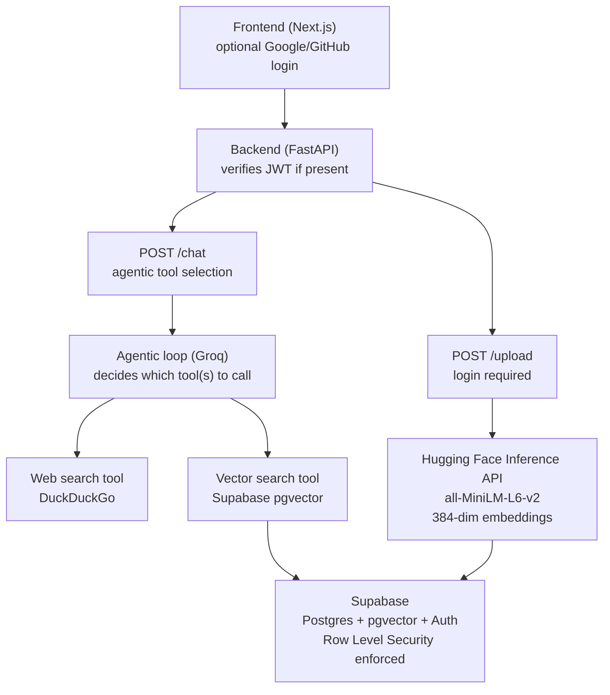

# S3RA — Agentic RAG Chatbot

S3RA is a chatbot that answers questions by combining two knowledge sources — a user's own uploaded documents and live web search — with an LLM deciding per question which source(s) to actually use, rather than always querying both.

Built as a **$0-infrastructure project** using Groq, Supabase, Hugging Face, Railway, and Vercel.

## Why this exists

A plain LLM chatbot is limited to what it memorized during training. Standard RAG grounds answers in a private document set but still can't answer questions about anything current.

S3RA does both, and adds an agentic layer on top: the model itself chooses whether a question needs the user's documents, a live web search, both, or neither — instead of that logic being hardcoded.

## Product shape

- Anyone can chat, no account required. Unauthenticated chat is answered using live web search only.
- Uploading documents requires an account. Logged-in users upload PDFs, which are chunked, embedded, and stored per-user.
- Logged-in users' chat additionally searches their own uploaded documents, strictly isolated from every other user's documents.
- Login is Google or GitHub OAuth only. There is no email/password flow.
- Document isolation is enforced by Postgres Row Level Security in Supabase, not just application-level filtering — the database itself refuses to return another user's rows even if the backend code has a bug.

## Architecture



## How it works

### 1. Preprocessing (offline, on upload)

Raw uploaded documents go through a fixed pipeline before anything is embedded:

1. **Extract** text from the source file (PDF, plain text, etc.).
2. **Clean & normalize** — strip page numbers, headers/footers, fix line-wrap artifacts, and Unicode-normalize. No stemming, lemmatizing, or stopword removal — those hurt embedding quality rather than helping it.
3. **Chunk** using structural boundaries (headers, paragraphs) where possible, falling back to size-based splitting with overlap, rather than blind fixed-word-count slicing.
4. **Deduplicate** near-identical chunks (common with repeated PDF boilerplate) before they reach the database.
5. **Embed & store** each chunk using the Hugging Face Inference API with `sentence-transformers/all-MiniLM-L6-v2`. The resulting 384-dimensional embeddings are stored with metadata (source filename, page number, section) and scoped to the uploading user's `user_id`.

The embedding model is hosted remotely through Hugging Face rather than downloaded and executed locally. This keeps the backend lightweight and avoids installing the `sentence-transformers`, `transformers`, or PyTorch stack.

### 2. The agentic query loop (online, per request)

On `/chat`, the backend verifies the JWT if one is present and extracts `user_id` (or proceeds as anonymous if not).

It builds a tool list for the request:

- Web search is available for every request.
- Internal document search is only offered when a `user_id` exists.

That tool list, along with the user's message, goes to Groq. If Groq responds with a tool call, the backend executes the corresponding Python function, appends the result to the conversation, and sends it back to Groq.

This repeats until Groq returns a final answer instead of another tool call.

When internal document search is requested, the query is embedded using the same Hugging Face-hosted `all-MiniLM-L6-v2` model used during ingestion. This keeps document and query vectors in the same 384-dimensional embedding space.

### 3. Postprocessing (before the answer is returned)

The draft answer is checked against the retrieved context for groundedness before being returned — flagging or softening claims that go beyond what the sources support.

Similarity scores below a confidence threshold trigger a fallback ("not found in your documents") instead of forcing an answer from a weak match.

Citations are attached using the metadata captured during preprocessing, and any cited source is verified to belong to the requesting user before being shown, as a second check on top of Row Level Security.

## Data isolation model

- Every row in the `documents` table carries a `user_id` referencing Supabase Auth.
- Row Level Security policies restrict `select` and `insert` to rows where `auth.uid() = user_id`.
- The `match_documents` similarity-search function requires an explicit `user_id` parameter and filters on it.
- RLS is treated as the enforced security boundary; explicit `user_id` filtering in application code is a second, redundant layer on top of it, not a substitute for it.

## Tech stack

| Layer | Choice |
|---|---|
| LLM | Groq |
| Embeddings | Hugging Face Inference API — `sentence-transformers/all-MiniLM-L6-v2` |
| Vector store | Supabase (Postgres + `pgvector`) |
| Auth | Supabase Auth — Google & GitHub OAuth only |
| Web search | DuckDuckGo (`ddgs`) |
| Backend | FastAPI, `uv` for dependency management |
| Frontend | Next.js |
| Backend hosting | Railway |
| Frontend hosting | Vercel |
| CI | GitHub Actions (lint + test on every PR) |

## Local setup

### Backend

```bash
cd backend

uv sync

uv run uvicorn main:app --reload --port 8000
```

### Frontend

```bash
cd frontend

npm install

npm run dev
```

### Required environment variables

Backend `.env` — never commit this file:

```env
GROQ_API_KEY=
GROQ_MODEL=

SUPABASE_URL=
SUPABASE_SERVICE_ROLE_KEY=
SUPABASE_ANON_KEY=

HF_TOKEN=

FRONTEND_ORIGIN=http://localhost:3000
```

Frontend environment variables:

```env
NEXT_PUBLIC_API_URL=
NEXT_PUBLIC_SUPABASE_URL=
NEXT_PUBLIC_SUPABASE_ANON_KEY=
```

Google and GitHub OAuth client credentials are configured directly in the Supabase Auth dashboard, not as backend environment variables.

## Deployment

S3RA is deployed using:

- **Frontend:** Vercel
- **Backend:** Railway
- **Database & authentication:** Supabase
- **Embedding inference:** Hugging Face Inference API
- **LLM inference:** Groq

Production architecture:

```text
                    ┌──────────────────┐
                    │      Vercel      │
                    │  Next.js frontend│
                    └────────┬─────────┘
                             │
                             │ HTTPS
                             ▼
                    ┌──────────────────┐
                    │     Railway      │
                    │   FastAPI backend│
                    └───────┬───┬──────┘
                            │   │
                 ┌──────────┘   └───────────┐
                 ▼                          ▼
          ┌──────────────┐          ┌─────────────────┐
          │   Supabase   │          │ Hugging Face    │
          │ Auth + DB    │          │ Inference API   │
          │ + pgvector   │          │ MiniLM          │
          └──────────────┘          └─────────────────┘
                 │
                 ▼
             ┌────────┐
             │  Groq  │
             └────────┘
```

## Roadmap

The project is built as a sequence of milestones, each broken into individually completable issues.

1. **Backend foundation** — FastAPI skeleton, environment config, health check.
2. **Data layer & preprocessing pipeline** — Supabase schema, `pgvector`, the extract → clean → chunk → dedupe → embed pipeline described above.
3. **Tools** — the vector search and web search functions the agent calls, tested independently of the LLM loop.
4. **Auth** — Google/GitHub OAuth via Supabase, multi-tenant schema with Row Level Security, the enforcement model decision (authenticated client vs. service-role with trusted filtering).
5. **Upload endpoint** — gated behind login, wired to the preprocessing pipeline.
6. **Chat endpoint** — optional auth, the agentic tool-calling loop, and the postprocessing pipeline described above.
7. **Frontend** — chat UI open to everyone, OAuth-only login, upload UI gated behind login, source/tool display.
8. **Deployment** — backend on Railway, frontend on Vercel, OAuth redirect URIs registered for the production domain, end-to-end live verification.
9. **CI/CD** — automated tests and linting via GitHub Actions, branch protection on `main`, documented rollback procedure.

## License

MIT